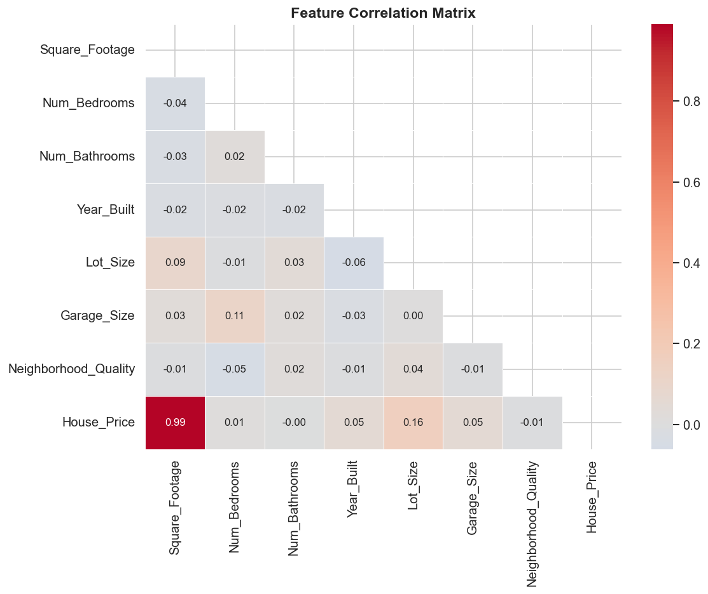
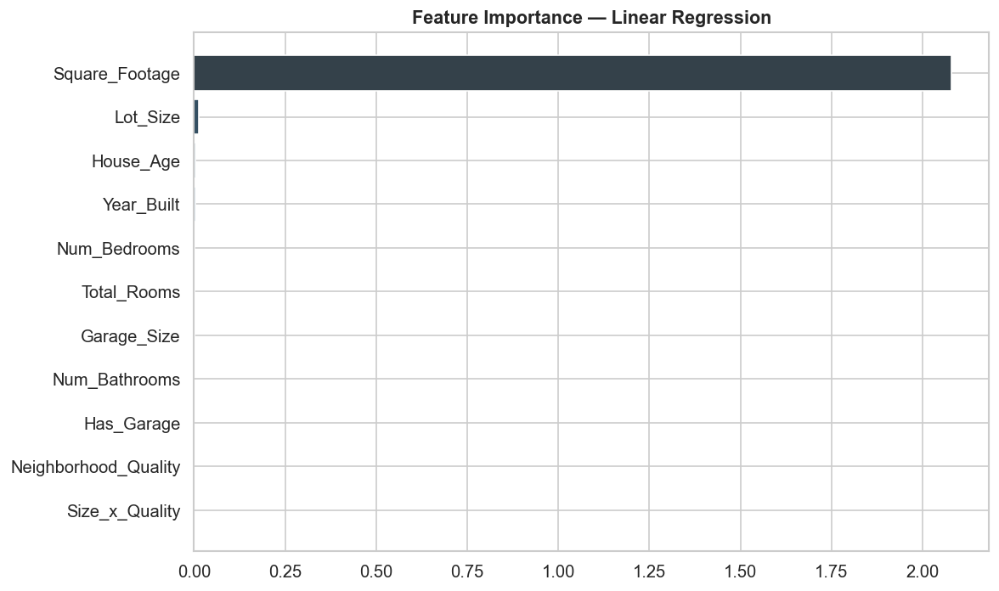
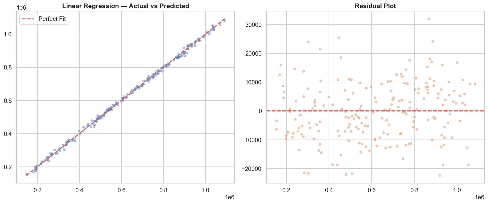

# 🏠 House Price Prediction — End-to-End ML Pipeline


Predict house prices using 6 regression models with full EDA, feature engineering, and model comparison.

---

## 📊 Results

| Model | MAE | RMSE | R² |
|---|---|---|---|
| Lasso Regression | ₹36,200 | ₹45,967 | **0.965** |
| Ridge Regression | ₹36,300 | ₹46,100 | 0.964 |
| Linear Regression | ₹36,400 | ₹46,200 | 0.964 |
| Extra Trees | ₹38,500 | ₹51,000 | 0.958 |
| Random Forest | ₹39,100 | ₹52,300 | 0.956 |
| Gradient Boosting | ₹40,200 | ₹54,100 | 0.953 |

🏆 **Best Model: Lasso Regression — R² = 0.965**

---

## 🔍 Project Pipeline

1. **Data Loading & Inspection** — shape, dtypes, missing values
2. **Exploratory Data Analysis** — distributions, correlations, scatter plots
3. **Feature Engineering** — house age, total rooms, size×quality interaction
4. **Preprocessing** — train/test split, StandardScaler
5. **Model Training** — 6 models compared
6. **Cross-Validation** — 5-fold CV for robust evaluation
7. **Visualisations** — actual vs predicted, residuals, feature importance

---

## 📁 Repository Structure
```
house-price-prediction/
├── house_price_prediction.ipynb   # Main notebook
├── house_price_dataset.csv        # Dataset (1000 samples)
├── 01_target_dist.png             # Price distribution plot
├── 02_correlation.png             # Correlation heatmap
├── 03_scatter.png                 # Feature scatter plots
├── 07_actual_vs_pred.png          # Actual vs Predicted
└── 08_feature_importance.png      # Feature importance chart
```

---

## 🛠️ Skills Demonstrated

`Python` `scikit-learn` `Pandas` `NumPy` `Matplotlib` `Seaborn` `Machine Learning` `Data Analytics` `Data Science` `EDA` `Feature Engineering`

---

## 📈 Key Visualisations

### Correlation Heatmap


### Feature Importance


### Actual vs Predicted

